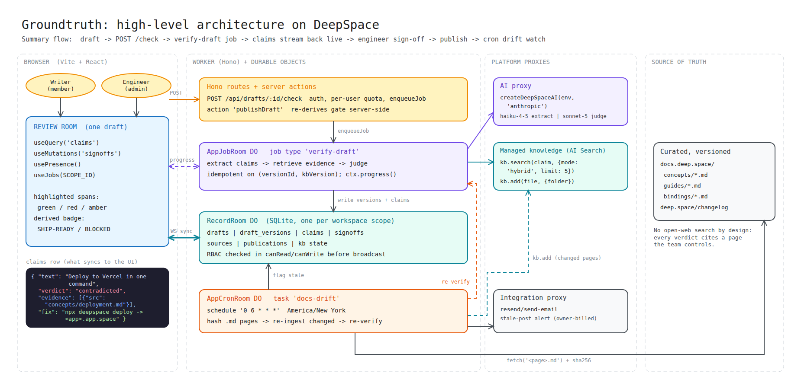

# CopyLint

Contradicted claim = error with an autofix. No evidence = warning. Engineer sign-off = a disable comment that requires a reason. Docs release = re-lint after a dependency upgrade.

**Spellcheck for technical truth.** CopyLint checks every technical claim in developer marketing content against
DeepSpace's own docs before it ships. Flagging published posts when the docs change is designed (ADR-0007) but not shipped yet.

Live: https://copylint.app.space · Built on the [DeepSpace SDK](https://docs.deep.space)



## 60-second tour
1. Sign in → **Drafts** → *Create from sample* (a launch thread with 5–6 claims).
2. **Check claims**: verdicts stream in live, each with cited docs excerpts and a suggested fix.
3. Open the same draft as an engineer in another browser. Approve or cut what isn't supported, and watch the badge update for both.
4. **Publish** only works when the server agrees the draft is ship-ready.
5. Admin → **Sources** → *Sync now* re-hashes the docs and re-ingests changed pages. Admin → **Users** promotes a writer to engineer. (Marking publications **stale** when a cited page changes is not shipped.)

## How it works
<link docs/diagrams: 01 concept, 02 architecture, 03 critical flow, 04 data model, 05 state machines>

## DeepSpace integrations
See `docs/adr/0008-integration-choices.md`: used, not used, and why.

## Run it
```bash
npm install
npx deepspace auth login
npx deepspace dev start
npx deepspace test run all
npx deepspace deploy
```

## Repo map for humans and agents
| File | Purpose |
|---|---|
| `AGENTS.md` | Canonical rules for every coding agent (roles, task loop, lanes, DeepSpace rules, security checklist) |
| `CLAUDE.md` | Claude Code orchestrator (Lane A) |
| `.claude/agents/` `.codex/` `.cursor/rules/` | Subagents and harness configs |
| `docs/PRD.md` · `docs/SPEC.md` | What and how (SPEC is the contract) |
| `docs/adr/` | Decisions and tradeoffs |
| `TASKS.md` · `docs/sprint-plan.md` · `todo.md` | Backlog, schedule, right-now list |
| `docs/TEST-PLAN.md` · `eval/` | Test strategy, golden set, probes, fixtures |
| `docs/VERIFICATION-LOG.md` · `docs/sprint-review.md` · `SUBMISSION.md` | Evidence of what agents did and what was verified |
